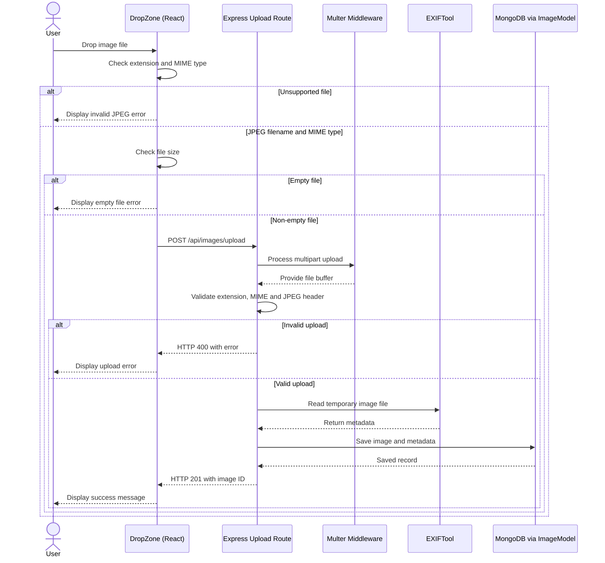

# JPEG Upload Validation — UML Sequence Diagram

This diagram documents the JPEG upload workflow implemented in `src/DropZone.tsx` and `src/server/server.ts`.

```mermaid
sequenceDiagram
    actor User
    participant UI as DropZone (React)
    participant API as Express Upload Route
    participant MW as Multer Middleware
    participant EXIF as EXIFTool
    participant DB as MongoDB via ImageModel

    User->>UI: Drop image file
    UI->>UI: Check extension and MIME type

    alt Unsupported file
        UI-->>User: Display invalid JPEG error
    else JPEG filename and MIME type
        UI->>UI: Check file size

        alt Empty file
            UI-->>User: Display empty file error
        else Non-empty file
            UI->>API: POST /api/images/upload
            API->>MW: Process multipart upload
            MW-->>API: Provide file buffer
            API->>API: Validate extension, MIME and JPEG header

            alt Invalid upload
                API-->>UI: HTTP 400 with error
                UI-->>User: Display upload error
            else Valid upload
                API->>EXIF: Read temporary image file
                EXIF-->>API: Return metadata
                API->>DB: Save image and metadata
                DB-->>API: Saved record
                API-->>UI: HTTP 201 with image ID
                UI-->>User: Display success message
            end
        end
    end
```
